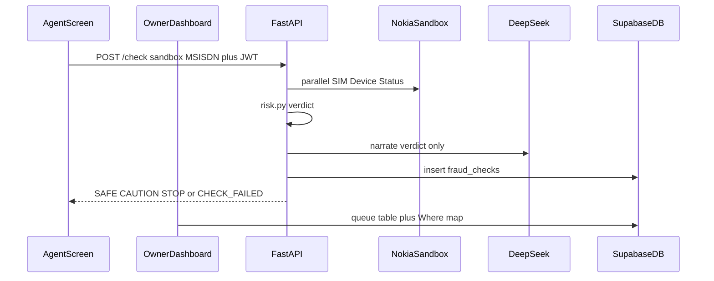

# MoMo Sentry — architecture

This is the production plan, kept in the repo root.

Build the booth system **now** on Nokia Network as Code **sandbox**. Do not wait for MTN/Airtel Zambia CAMARA. Do not disguise `+999` as `+260`.

What this solves today: a real CAMARA verdict (canned numbers, same API contract), the till check is enforced in-app, every check is logged, the owner sees who / which number / which booth / who never checked.

What this does not solve: a live Lusaka SIM swap on a real `+260` line. Later: `NAC_MODE=production` plus live numbers — same code path.

Stack: FastAPI + Next.js + Supabase + DeepSeek. Agent screen is a check. Owner home is the operations table. Map is a Where tab.



---

## Shared database with PAR-Map (do not touch the loan map)

MoMo Sentry and PAR-Map use the **same Supabase project**. That is a cost/ops choice, not a product merge.

PAR-Map’s real product is the loan map. It reads `customers`, `profiles`, `teams`, `kmz_layers`, `buffer_layers`, and Storage `kmz-files`. Auth is the cookie `sb-<projectRef>-auth-token` plus `middleware.ts`.

MoMo Sentry is a **second app** on that project. Isolation is by **table + session key**, not by forking Postgres.

```
Same Supabase project
├── PAR-Map (untouched)
│   ├── auth cookie: sb-<ref>-auth-token
│   ├── tables: customers, profiles, teams, kmz_layers, buffer_layers
│   └── storage: kmz-files
└── MoMo Sentry (additive only)
    ├── auth storage: sb-momo-auth-token
    ├── tables: fraud_checks, booth_agents, booth_locations
    └── new tables: momo_profiles, agent_sessions
```

### Rules so PAR-Map keeps working

1. **Never migrate PAR-Map tables.** No `ALTER` / `DROP` / new RLS on `customers`, `profiles`, `teams`, `kmz_layers`, `buffer_layers`, or Storage.
2. **Never share the PAR-Map cookie.** MoMo uses `sb-momo-auth-token`. A loan officer logged into `par-map.vercel.app` is not logged into MoMo, and a booth agent is not logged into the loan map.
3. **Auth users can coexist.** `auth.users` is one pool. Creating a MoMo agent does not change PAR-Map `profiles` rows. Do not delete or rewrite PAR-Map users.
4. **SQL is additive.** New tables (`momo_profiles`, `agent_sessions`). Extra columns on `fraud_checks` (`agent_id`, `agent_name`). Extra verdict value `CHECK_FAILED`. Existing SAFE/CAUTION/STOP rows stay valid.
5. **Do not drop the old `fraud_checks` read policy yet.** PAR-Map still has leftover `/sentry` and `/agent` pages from the hackathon. Those pages are **not** the loan map, but they sit in the same Next app. Dropping “authenticated users can read checks” would empty those leftover screens. The loan map would still work. Leave the broad read policy in place until those PAR-Map routes are retired in a **separate** PAR-Map change.
6. **Do not lock `booth_agents` / `booth_locations` behind MoMo-only RLS** while PAR-Map still lists them. Owner/agent policies on MoMo tables are extra, not a replacement, until PAR-Map’s Sentry pages are gone.
7. **Writes stay on the service role.** FastAPI inserts `fraud_checks` with `SUPABASE_SERVICE_KEY`. PAR-Map never writes those rows.
8. **FastAPI CORS is MoMo’s origin.** `FRONTEND_ORIGIN` is the MoMo Vercel app (plus localhost). That does not change PAR-Map’s own API calls to Supabase.

### What actually breaks if we get this wrong

| Change | Loan map (`/map`) | Leftover PAR-Map `/sentry` |
|---|---|---|
| Add `momo_profiles` / `agent_sessions` | No | No |
| Allow `CHECK_FAILED` on `fraud_checks` | No | Still shows SAFE/CAUTION/STOP |
| Drop “authenticated can read checks” | No | Empty table / RLS errors |
| Enable owner-only RLS on `booth_agents` | No | Agent list empty |
| Alter `customers` / `profiles` | **Yes — never do this** | — |
| Switch MoMo to `sb-momo-auth-token` | No (different cookie) | No |

So: **same database, two products.** PAR-Map flow is the loan map. We do not patch PAR-Map to ship MoMo. When you later delete `/sentry` and `/agent` from PAR-Map, that is a PAR-Map cleanup MR — not a MoMo schema change.

`par-map.vercel.app` posting to the MoMo FastAPI without a MoMo JWT will 401 once `REQUIRE_AUTH=true`. That is the API, not the loan map. Leave PAR-Map’s `/sentry` as a dead demo, or keep `REQUIRE_AUTH=false` until that site stops calling FastAPI.

---

## Sandbox fraud story

Nokia simulators return fixed outcomes. The agent does not invent Zambian numbers. Named test customers:

| Badge | Numbers |
|---|---|
| SAFE | `+99999991000`, `+99999991001` |
| STOP | `+99999990400`, `+99999990404` |
| CAUTION | `+99999990422` |

Typing `+999…` is allowed. Typing `097…` / `+260…` returns **CHECK FAILED**: this environment cannot query Zambian SIMs. No silent remap.

Persistent **Sandbox** banner on agent and owner screens. Logs store the real `+999` value. DeepSeek narrates that number; do not invent a Lusaka MSISDN.

Nokia’s sandbox has been inconsistent (sometimes `swapped: true` for all). Show whatever the API returned. HTTP failure is **CHECK FAILED**, never SAFE.

SAFE means no swap in the last 72 hours on this simulator — not that the person is legitimate.

---

## Owner UI

Same jobs as the old `/sentry` (counts, agents, logs, map). Default changed:

- **Queue (home):** KPIs, full-width flags table, repeat simulator numbers, agents with zero checks, failed checks
- **Where:** existing Mapbox, same rows
- Sandbox banner

Not a new product. Not a map delete.

---

## Check pipeline

1. Accept only sandbox MSISDNs (`+999…`). Reject `+260` with `CHECK_FAILED`.
2. `camara.run_checks` in parallel (SIM swap, device swap, device status).
3. `risk.py` scores. SIM-swap API error → `CHECK_FAILED`, never SAFE.
4. One DeepSeek call to narrate the already-decided verdict. DeepSeek does not pick tools or set the badge.
5. Agent UI: tap-to-check test customers + optional typed `+999`.

---

## Trust boundary

- `momo_profiles` (`agent` | `owner`). Seed one owner in SQL. Agent register stays public, role `agent` only.
- FastAPI `/check` requires Bearer JWT (`REQUIRE_AUTH=true`). Bind `agent_id` from the token, not the body.
- CORS from `FRONTEND_ORIGIN`.
- Rate-limit `/check` (30/minute per user).
- Session memory in `agent_sessions`.

---

## Hosting

Render Web Service (`render.yaml`), paid instance so it does not sleep.

Env: `NAC_API_KEY`, `DEEPSEEK_API_KEY`, `SUPABASE_URL`, `SUPABASE_SERVICE_KEY`, `FRONTEND_ORIGIN`, `NAC_MODE=sandbox`, `REQUIRE_AUTH=true`.

Frontend `NEXT_PUBLIC_MOMO_SENTRY_API` points at Render.

---

## Out of scope

- Live MTN Zambia / Airtel Zambia CAMARA (later: `NAC_MODE=production` + E.164 `+260`).
- Mapping `+260` → `+999` to look real.
- USSD, till embed, Auth0, Convex, a new Supabase project.
- Using PAR-Map as source of truth.
- Editing PAR-Map code or its RLS to ship this.

---

## Deploy order

1. Additive SQL (`supabase/migrations/002_production_auth.sql`) — new tables, extra columns, extra policies. **Do not drop** PAR-Map-era read policies.
2. Seed an owner in `momo_profiles` or `/sentry` is a login wall.
3. MoMo frontend live with JWT.
4. `REQUIRE_AUTH=true` on Render.
5. Later, in a PAR-Map-only change: remove leftover `/sentry` and `/agent`. Only then drop “any authenticated user reads all `fraud_checks`.”

---

## Success criteria

- Agent can complete SAFE / STOP / CAUTION using sandbox presets; Nokia is actually called.
- `+260` does not return a fake STOP/SAFE.
- Nokia HTTP failure is CHECK FAILED on screen and in the owner table.
- Owner home is the queue; map is a tab; both show Sandbox.
- Unauthenticated `/check` is 401 once auth is on.
- DeepSeek only narrates.
- PAR-Map loan map still loads customers and KMZ after the MoMo SQL runs.
