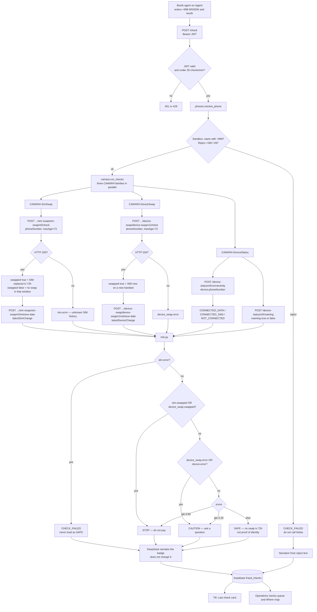

# MoMo Sentry — architecture

This is the production plan, kept in the repo root.

Build the booth system **now** on Nokia Network as Code **sandbox**. Do not wait for MTN/Airtel Zambia CAMARA. Do not disguise `+999` as `+260`.

What this solves today: a real CAMARA call (canned numbers, same API contract), the till check is in-app, every check is logged, the owner sees who / which number / which booth / who never checked.

What this does not solve: a live Lusaka SIM swap on a real `+260` line. Later: `NAC_MODE=production` plus live numbers — same code path.

## Live hosts

| Service | URL |
|---|---|
| Web | https://momo-sentry-1.onrender.com |
| Booth till | https://momo-sentry-1.onrender.com/agent |
| Operations | https://momo-sentry-1.onrender.com/sentry |
| API | https://momo-sentry.onrender.com |
| Health | https://momo-sentry.onrender.com/health |

Local: Next `http://localhost:3000`, FastAPI `http://localhost:8000`.

Stack: FastAPI + Next.js (this repo) + Supabase + DeepSeek. Agent screen is a phone-width till. Owner home is the operations table. Map is a Where tab. Login for both apps is the dark AuthShell. Icons are Lucide. Tokens come from `frontend/src/styles/globals.css`.

---

## How a check works

CAMARA is the GSMA Open Gateway / TM Forum API family for telco capabilities. Nokia Network as Code exposes those APIs over RapidAPI. MoMo Sentry does **not** let the LLM choose tools. FastAPI always calls the three CAMARA families in parallel, `risk.py` sets the badge, DeepSeek only writes the sentence the agent reads.

Official CAMARA operations (what an MNO is supposed to implement) vs the Nokia RapidAPI paths in `camara.py`:

| Family | Official CAMARA | Nokia NaC path we call | Intended contract |
|---|---|---|---|
| [SIM Swap](https://github.com/camaraproject/SimSwap) | `POST /sim-swap/v0/check` `{phoneNumber, maxAge}` → `{swapped}` | `POST /passthrough/camara/v1/sim-swap/sim-swap/v0/check` | `swapped: true` if the SIM on this MSISDN was replaced in the last `maxAge` hours (spec: 1–2400, default 240; we send **72**). Core MoMo-fraud signal. |
| | `POST /sim-swap/v0/retrieve-date` `{phoneNumber}` → `{latestSimChange}` | `POST /passthrough/camara/v1/sim-swap/sim-swap/v0/retrieve-date` | RFC 3339 timestamp of the last SIM change (or activation date if never swapped). `null` if the MNO cannot retain that far. |
| [Device Swap](https://github.com/camaraproject/DeviceSwap) | `POST /device-swap/v1/check` → `{swapped}` | `POST /passthrough/camara/v1/device-swap/device-swap/v1/check` | `swapped: true` if the SIM moved onto a different handset in `maxAge` hours. With SIM swap this is a stronger “stolen line + new phone” story. |
| | `POST /device-swap/v1/retrieve-date` → `{latestDeviceChange}` | `POST /passthrough/camara/v1/device-swap/device-swap/v1/retrieve-date` | Timestamp of the last device change. |
| [Device Status](https://github.com/camaraproject/DeviceStatus) | `POST /device-status/v0/connectivity` `{device:{phoneNumber}}` → `{connectivityStatus}` | `POST /device-status/v0/connectivity` | `CONNECTED_DATA` / `CONNECTED_SMS` / `NOT_CONNECTED`. Off-net or SMS-only is unusual for a local cash-out. |
| | `POST /device-status/v0/roaming` → `{roaming}` | `POST /device-status/v0/roaming` | `true` if the device is roaming. Unexpected for a Lusaka booth payout. |

Nokia host: `https://network-as-code.p-eu.rapidapi.com` (`x-rapidapi-host: network-as-code.nokia.rapidapi.com`). Swap APIs sit under Nokia’s `/passthrough/camara/v1/…` wrapper; Device Status is called as the CAMARA path. Bodies are CAMARA JSON, not Nokia-specific.



On a production MNO the same flowchart holds: set `NAC_MODE=production`, send E.164 `+260…`, and the operator’s CAMARA gateway answers `check` / `retrieve-date` / `connectivity` / `roaming` instead of Nokia’s `+999` simulators. Sandbox numbers that HTTP 400 or always return `swapped: true` are Nokia test-harness bugs, not a change to this intended contract — see BUG-006 and BUG-007.

---

## Shared database with PAR-Map (do not touch the loan map)

MoMo Sentry and PAR-Map use the **same Supabase project**. That is a cost/ops choice, not a product merge.

PAR-Map’s real product is the loan map. It reads `customers`, `profiles`, `teams`, `kmz_layers`, `buffer_layers`, and Storage `kmz-files`. Auth is the cookie `sb-<projectRef>-auth-token` plus `middleware.ts`.

MoMo Sentry is a **second app** on that project. Isolation is by **table + session key**, not by forking Postgres. The MoMo UI is **not** hosted on `par-map.vercel.app` — that leftover `/sentry` and `/agent` there is a dead demo.

```
Same Supabase project
├── PAR-Map (untouched)
│   ├── auth cookie: sb-<ref>-auth-token
│   ├── tables: customers, profiles, teams, kmz_layers, buffer_layers
│   └── storage: kmz-files
└── MoMo Sentry (additive only)
    ├── auth storage: sb-momo-auth-token
    ├── tables: fraud_checks, booth_agents, booth_locations
    └── new tables: momo_profiles, agent_sessions
```

### Rules so PAR-Map keeps working

1. **Never migrate PAR-Map tables.** No `ALTER` / `DROP` / new RLS on `customers`, `profiles`, `teams`, `kmz_layers`, `buffer_layers`, or Storage.
2. **Never share the PAR-Map cookie.** MoMo uses `sb-momo-auth-token`. A loan officer logged into `par-map.vercel.app` is not logged into MoMo, and a booth agent is not logged into the loan map.
3. **Auth users can coexist.** `auth.users` is one pool. Creating a MoMo agent does not change PAR-Map `profiles` rows. Do not delete or rewrite PAR-Map users.
4. **SQL is additive.** New tables (`momo_profiles`, `agent_sessions`). Extra columns on `fraud_checks` (`agent_id`, `agent_name`). Extra verdict value `CHECK_FAILED`. Existing SAFE/CAUTION/STOP rows stay valid.
5. **Do not drop the old `fraud_checks` read policy yet.** PAR-Map still has leftover `/sentry` and `/agent` pages from the hackathon. Those pages are **not** the loan map, but they sit in the same Next app. Dropping “authenticated users can read checks” would empty those leftover screens. The loan map would still work. Leave the broad read policy in place until those PAR-Map routes are retired in a **separate** PAR-Map change.
6. **Do not lock `booth_agents` / `booth_locations` behind MoMo-only RLS** while PAR-Map still lists them. Owner/agent policies on MoMo tables are extra, not a replacement, until PAR-Map’s Sentry pages are gone.
7. **Writes stay on the service role.** FastAPI inserts `fraud_checks` with `SUPABASE_SERVICE_KEY`. PAR-Map never writes those rows.
8. **FastAPI CORS is MoMo’s origin.** `FRONTEND_ORIGIN` is `https://momo-sentry-1.onrender.com` plus localhost. CORS also allows `http://localhost` / `127.0.0.1` any port via regex. That does not change PAR-Map’s own API calls to Supabase.

### What actually breaks if we get this wrong

| Change | Loan map (`/map`) | Leftover PAR-Map `/sentry` |
|---|---|---|
| Add `momo_profiles` / `agent_sessions` | No | No |
| Allow `CHECK_FAILED` on `fraud_checks` | No | Still shows SAFE/CAUTION/STOP |
| Drop “authenticated can read checks” | No | Empty table / RLS errors |
| Enable owner-only RLS on `booth_agents` | No | Agent list empty |
| Alter `customers` / `profiles` | **Yes — never do this** | — |
| Switch MoMo to `sb-momo-auth-token` | No (different cookie) | No |

So: **same database, two products.** PAR-Map flow is the loan map. We do not patch PAR-Map to ship MoMo. When you later delete `/sentry` and `/agent` from PAR-Map, that is a PAR-Map cleanup MR — not a MoMo schema change.

`par-map.vercel.app` posting to the MoMo FastAPI without a MoMo JWT will 401 once `REQUIRE_AUTH=true`. That is the API, not the loan map.

---

## Sandbox fraud story

Nokia simulators return fixed outcomes. The agent does not invent Zambian numbers. Named test customers:

| Badge | Numbers |
|---|---|
| SAFE | `+99999991000`, `+99999991001` |
| STOP | `+99999990400`, `+99999990404` |
| CAUTION | `+99999990422` |

Typing `+999…` is allowed. Typing `097…` / `+260…` returns **CHECK FAILED**: this environment cannot query Zambian SIMs. No silent remap.

Persistent **Sandbox** banner on agent and owner screens. Logs store the real `+999` value. DeepSeek narrates that number; do not invent a Lusaka MSISDN.

Nokia’s sandbox does not match the table reliably:

- STOP number `+99999990400` currently returns HTTP 400 → **CHECK FAILED** (BUG-006).
- SAFE number `+99999991000` currently returns `swapped: true` → **STOP** (BUG-007).

Show whatever the API returned. HTTP failure is **CHECK FAILED**, never SAFE.

SAFE means no swap in the last 72 hours on this simulator — not that the person is legitimate.

---

## Owner UI

- **Queue (home):** KPIs, full-width flags table, repeat simulator numbers, agents with zero checks, failed checks
- **Where:** Mapbox, same rows
- Sandbox banner

Not a new product. Not a map delete.

---

## Agent till

- Full-viewport column, max-width 430px, paper tokens from `globals.css` (no fake phone bezel, no royal-blue kit palette).
- Login and register stay on AuthShell (same as operations). Forgot password → `/reset?next=/agent`.
- After login: Number check, sandbox chips, booth select, Last check card, floating Check + Sign out.
- Theme toggle on the till follows `data-theme`.

---

## Check pipeline

Same as the flowchart above, in code order:

1. Accept only sandbox MSISDNs (`+999…`). Reject `+260` with `CHECK_FAILED`.
2. `camara.run_checks` in parallel — CAMARA SIM Swap (`/check` + `/retrieve-date`), Device Swap (`/check` + `/retrieve-date`), Device Status (`/connectivity` + `/roaming`).
3. `risk.py` scores. Intended CAMARA contract: `swapped: false` inside 72h is the SAFE path; `swapped: true` is STOP; SIM Swap HTTP error is `CHECK_FAILED` (unknown history, never SAFE). Device-status errors alone are CAUTION.
4. One DeepSeek call to narrate the already-decided verdict. DeepSeek does not pick tools or set the badge.
5. Agent UI: tap-to-check test customers + optional typed `+999`. Operations reads `fraud_checks`.

---

## Trust boundary

- `momo_profiles` (`agent` | `owner`). First owner: `GET /setup/owner-needed` then `POST /setup/claim-owner`. Agent register stays public, role `agent` only.
- FastAPI `/check` requires Bearer JWT (`REQUIRE_AUTH=true`). Bind `agent_id` from the token, not the body.
- CORS from `FRONTEND_ORIGIN` plus localhost regex.
- Rate-limit `/check` (30/minute per user).
- Session memory in `agent_sessions`.
- Password reset is Supabase `resetPasswordForEmail` / `updateUser`. Redirect URLs must include `/reset` on localhost and the live web origin.

---

## Hosting

Two Render Web Services (`render.yaml`).

| Service | Public URL |
|---|---|
| `momo-sentry` (Python) | https://momo-sentry.onrender.com |
| `momo-sentry-web` (Node) | https://momo-sentry-1.onrender.com |

Env on the API: `NAC_API_KEY`, `DEEPSEEK_API_KEY`, `SUPABASE_URL`, `SUPABASE_SERVICE_KEY`, `FRONTEND_ORIGIN`, `NAC_MODE=sandbox`, `REQUIRE_AUTH=true`.

Frontend `NEXT_PUBLIC_MOMO_SENTRY_API` points at the API. `NAC_API_KEY` is never `NEXT_PUBLIC_*`.

If `/health` reports `"degraded"` and `missing_env`, checks and owner claim will fail on that host until the keys are set (BUG-008).

---

## Out of scope

- Live MTN Zambia / Airtel Zambia CAMARA (later: `NAC_MODE=production` + E.164 `+260`).
- Mapping `+260` → `+999` to look real.
- USSD, till embed, Auth0, Convex, a new Supabase project.
- Using PAR-Map as source of truth.
- Editing PAR-Map code or its RLS to ship this.

---

## Deploy order

1. Additive SQL (`supabase/migrations/002_production_auth.sql`) — new tables, extra columns, extra policies. **Do not drop** PAR-Map-era read policies.
2. Seed an owner in `momo_profiles` or claim via `/sentry` when `owner_needed` is true.
3. MoMo frontend live with JWT (`https://momo-sentry-1.onrender.com`).
4. `REQUIRE_AUTH=true` on Render.
5. Later, in a PAR-Map-only change: remove leftover `/sentry` and `/agent`. Only then drop “any authenticated user reads all `fraud_checks`.”

---

## Success criteria

- Agent can complete a check using sandbox presets; Nokia is actually called.
- `+260` does not return a fake STOP/SAFE.
- Nokia HTTP failure is CHECK FAILED on screen and in the owner table.
- Owner home is the queue; map is a tab; both show Sandbox.
- Unauthenticated `/check` is 401 once auth is on.
- DeepSeek only narrates.
- PAR-Map loan map still loads customers and KMZ after the MoMo SQL runs.
- Chooser `/` does not skip to `/agent`.
